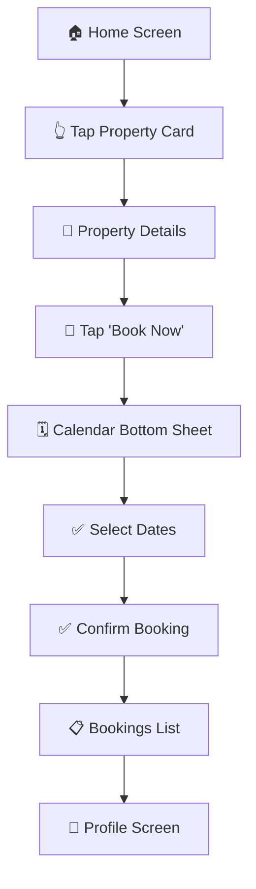

# 🏡 Property Booking App

A modern, intuitive mobile application built with **React Native (Expo)** and **TypeScript** that enables users to discover, book, and manage property reservations with a seamless calendar-based booking experience.

<div align="center">
  
  
  
  
</div>

---

## ✨ Features

🏠 **Property Discovery**
- Browse through 20 beautifully designed property cards
- View high-quality images and key property details
- Smooth navigation with React Navigation

📱 **Seamless Booking Experience**  
- Interactive calendar modal with date selection
- Modern bottom sheet UI for booking flow
- Real-time date validation and availability

📊 **Booking Management**
- View all confirmed reservations in one place
- Easy-to-read booking details and dates
- Persistent booking state with Zustand

👤 **User Profile**
- Clean profile interface with user information
- Centralized account management

---

## 🚀 Quick Start

### Prerequisites

Before you begin, ensure you have the following installed:
- [Node.js](https://nodejs.org/) (v16 or higher)
- [npm](https://www.npmjs.com/) or [Yarn](https://yarnpkg.com/)
- [Expo CLI](https://docs.expo.dev/get-started/installation/)
- [Expo Go app](https://expo.dev/client) on your mobile device (for testing)

### Installation Steps

1. **Clone the repository**
   ```bash
   git clone https://github.com/your-username/property-booking-app.git
   ```

2. **Navigate to project directory**
   ```bash
   cd property-booking-app
   ```

3. **Install dependencies**
   ```bash
   npm install
   # or if you prefer yarn
   yarn install
   ```

4. **Start the JSON Server (Mock API)**
   ```bash
   # In a separate terminal window
   npx json-server --watch db.json --port 3001
   ```
   > **Note:** The JSON server provides mock property data and runs on `http://localhost:3001`

5. **Start the Expo development server**
   ```bash
   npx expo start
   ```

6. **Run the app**
   - Scan the QR code with your Expo Go app (iOS/Android)
   - Or press `i` for iOS simulator / `a` for Android emulator
   - Or press `w` to run in web browser

---

## 🛠 Tech Stack

| Technology | Purpose | Version |
|------------|---------|---------|
| **React Native (Expo)** | Cross-platform mobile development | Latest |
| **TypeScript** | Type safety and enhanced developer experience | ^4.9.0 |
| **React Navigation** | Screen navigation and routing | ^6.x |
| **@gorhom/bottom-sheet** | Modern bottom sheet components | ^4.x |
| **react-native-calendars** | Calendar UI and date selection | ^1.x |
| **Zustand** | Lightweight state management | ^4.x |
| **NativeWind** | Tailwind CSS for React Native | ^2.x |
| **JSON Server** | Mock REST API for development | ^0.17.x |

---

## 📁 Project Structure

```
property-booking-app/
├── 📂 assets/                 # Images, fonts, and static resources
├── 📂 components/             # Reusable UI components
│   ├── PropertyCard.tsx
│   ├── BookingCalendar.tsx
│   └── CustomButton.tsx
├── 📂 screens/                # Application screens
│   ├── HomeScreen.tsx
│   ├── PropertyDetailScreen.tsx
│   ├── BookingsScreen.tsx
│   └── ProfileScreen.tsx
├── 📂 store/                  # Zustand state management
│   └── bookingStore.ts
├── 📂 navigation/             # Navigation configuration
│   └── AppNavigator.tsx
├── 📂 types/                  # TypeScript type definitions
│   └── index.ts
├── 📂 utils/                  # Helper functions and constants
│   └── dateUtils.ts
├── 📄 db.json                 # JSON Server mock database
├── 📄 App.tsx                 # Application entry point
├── 📄 tailwind.config.js      # Tailwind CSS configuration
└── 📄 package.json            # Dependencies and scripts
```

---

## 🔄 User Flow



1. **Discovery** → Browse 20 property cards on the home screen
2. **Details** → Tap any card to view comprehensive property information
3. **Booking** → Click "Book Now" to open the calendar bottom sheet
4. **Date Selection** → Choose check-in and check-out dates
5. **Confirmation** → Review and confirm your booking
6. **Management** → View all bookings in the dedicated bookings screen
7. **Profile** → Access user information and app settings

---

## 💾 State Management

The app uses **Zustand** for efficient global state management:

```typescript
interface Booking {
  id: string;
  propertyId: string;
  propertyTitle: string;
  checkInDate: string;
  checkOutDate: string;
  totalPrice: number;
  createdAt: string;
}

interface BookingStore {
  bookings: Booking[];
  selectedDates: {
    checkIn: string | null;
    checkOut: string | null;
  };
  addBooking: (booking: Booking) => void;
  setSelectedDates: (dates: { checkIn: string; checkOut: string }) => void;
  clearSelectedDates: () => void;
}
```

---

## 🗃️ Mock Data (JSON Server)

The `db.json` file contains structured mock data:

```json
{
  "properties": [
    {
      "id": "1",
      "title": "Luxury Beach Villa",
      "location": "Malibu, CA",
      "price": 450,
      "rating": 4.9,
      "images": ["url1", "url2"],
      "amenities": ["WiFi", "Pool", "Beach Access"],
      "description": "Beautiful oceanfront villa..."
    }
  ],
  "bookings": [],
  "users": [
    {
      "id": "1",
      "name": "John Doe",
      "email": "john@example.com",
      "avatar": "avatar_url"
    }
  ]
}
```

---

## 🧪 Development Scripts

```bash
# Start development server
npm start

# Start with tunnel (for testing on different networks)
npm run start:tunnel

# Start JSON Server
npm run json-server

# Type checking
npm run type-check

# Lint code
npm run lint

# Build for production
npm run build
```

---

## 📱 Testing

### On Device
1. Install **Expo Go** from App Store/Google Play
2. Scan QR code from terminal
3. Test all features on your device

### On Simulator
```bash
# iOS Simulator (requires Xcode)
npx expo start --ios

# Android Emulator (requires Android Studio)
npx expo start --android
```

---

## 🔧 Configuration

### Environment Variables
Create a `.env` file in the root directory:

```env
API_BASE_URL=http://localhost:3001
EXPO_PUBLIC_API_URL=http://localhost:3001
```

### Tailwind Configuration
Customize styling in `tailwind.config.js`:

```javascript
module.exports = {
  content: ["./App.{js,jsx,ts,tsx}", "./components/**/*.{js,jsx,ts,tsx}"],
  theme: {
    extend: {
      colors: {
        primary: '#007AFF',
        secondary: '#34C759',
      },
    },
  },
  plugins: [],
}
```

---

## 🚨 Important Notes

- **Development Only**: This app uses mock data and local storage
- **No Authentication**: User is assumed to be logged in
- **Temporary Storage**: Bookings reset on app restart
- **JSON Server Required**: Must run `json-server` for property data

---

## 🔮 Future Enhancements

### Phase 1 - Core Improvements
- [ ] **Persistent Storage** - AsyncStorage integration
- [ ] **User Authentication** - Login/Register functionality
- [ ] **Push Notifications** - Booking confirmations and reminders

### Phase 2 - Advanced Features
- [ ] **Real Backend API** - Replace JSON Server
- [ ] **Payment Integration** - Stripe/PayPal integration
- [ ] **Property Search & Filters** - Advanced search capabilities
- [ ] **Map Integration** - Property location visualization

### Phase 3 - Premium Features
- [ ] **Real-time Chat** - Host-Guest communication
- [ ] **Reviews & Ratings** - User feedback system
- [ ] **Multi-language Support** - Internationalization
- [ ] **Offline Mode** - Cached data access

---


